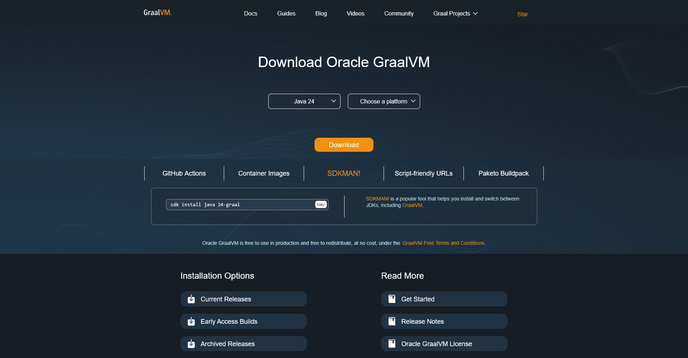
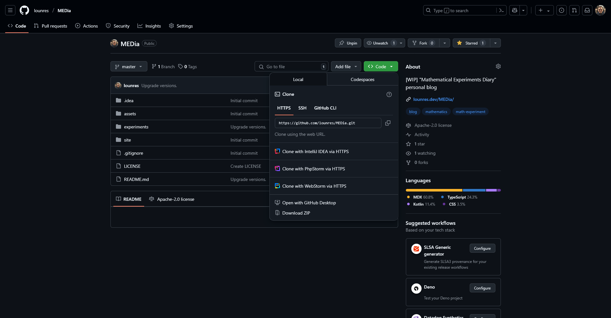

Here is the plan:
1. Set up JVM on your computer.
2. Clone/download the MEDia project.
3. Run corresponding task.

## Set up JDK on your computer

If you don't know how to set up any variant of JVM (Java Virtual Machine), then here is an instruction:
1. Got to https://www.graalvm.org/downloads/.
2. Select any version of Java in the first dropdown menu (Java 24 should be selected by default)
    and your computer's platform in the second dropdown menu.
    
3. Click "Download" to download the distributive.
4. Unpack the downloaded archive in any folder of your choice.
5. Add the `bin` directory in the chosen directory to your `PATH` environment variable.

## Clone/download the MEDia project

You can either clone the whole project via Git or download it as a ZIP archive.
It is up to you which way to choose.

### Clone the MEDia project

1. [Install Git](https://git-scm.com/downloads) if you haven't done it.
2. Choose a directory for the cloned MEDia project. Let its absolute path be `X`.
3. Run `git clone https://github.com/lounres/MEDia.git X` command in shell.
4. Open directory `experiments/NNN` directory where `NNN` is the experiment number.

### Download the MEDia project

1. Go to https://github.com/lounres/MEDia and click on the green "Code" button to see a dropdown menu.
    
2. Click on "Download ZIP" at the bottom of the dropdown menu to download archive with the MEDia project.
3. Choose a directory for the MEDia project and unpack the downloaded archive into it.
4. Open directory `experiments/NNN` directory where `NNN` is the experiment number.

## Run corresponding task

Just look at the experiment's `README.md` file for the run instruction.