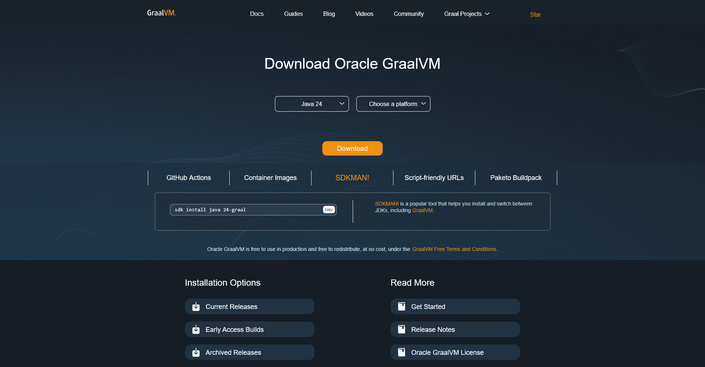
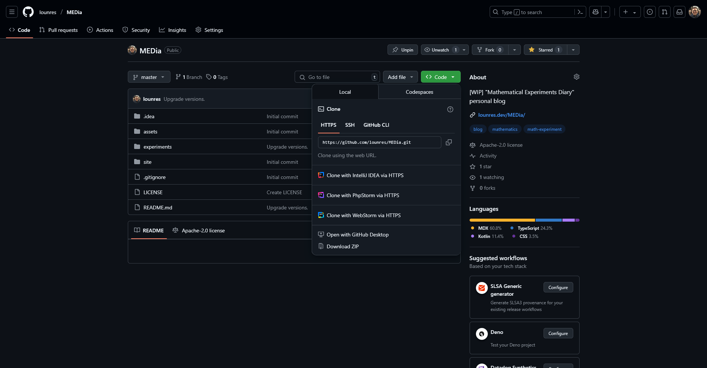

План:
1. Настройте JVM на Вашем компьютере.
2. Склонируйте/скачайте проект MEDia.
3. Запустите соответствующую задачу.

## Настройте JVM на Вашем компьютере

Если Вы не знаете, как настроить любой вариант JVM (Java Virtual Machine), то вот инструкция:
1. Перейдите по https://www.graalvm.org/downloads/.
2. Выберите любую версию Java в первом выпадающем меню (по умолчанию должна быть выбрана Java 24)
    и платформу Вашего компьютера во втором выпадающем меню.
    
3. Кликните "Download", чтобы скачать дистрибутив.
4. Распакуйте скачанный архив в любую папку по Вашему выбору.
5. Добавьте директорию `bin` в ней в Вашу переменную окружения `PATH`.

## Склонируйте/скачайте проект MEDia

Вы можете либо склонировать весь проект с помощью Git или скачать его как архив ZIP.
Какой путь выбрать, решайте сами.

### Склонируйте проект MEDia

1. [Установите Git](https://git-scm.com/downloads) если ещё не сделали этого.
2. Выберите директорию для склонированного проекта MEDia. Обозначим его абсолютный путь за `X`.
3. Запустите команду `git clone https://github.com/lounres/MEDia.git X` в консоли.
4. Откройте директорию `experiments/NNN`, где `NNN` &mdash; номер эксперимента.

### Скачайте проект MEDia

1. Перейдите по https://github.com/lounres/MEDia и кликните на зелёную кнопку "Code", чтобы увидеть выпадающее меню.
    
2. Кликните "Download ZIP" в самом низу выпадающего меню, чтобы скачать архив с проектом MEDia.
3. Выберите директорию для проекта MEDia и распакуйте скачанный архив в неё.
4. Откройте директорию `experiments/NNN`, где `NNN` &mdash; номер эксперимента.

## Запустите соответствующую задачу

Просто посмотрите в файл `README.md` данного эксперимента для инструкций по запуску.